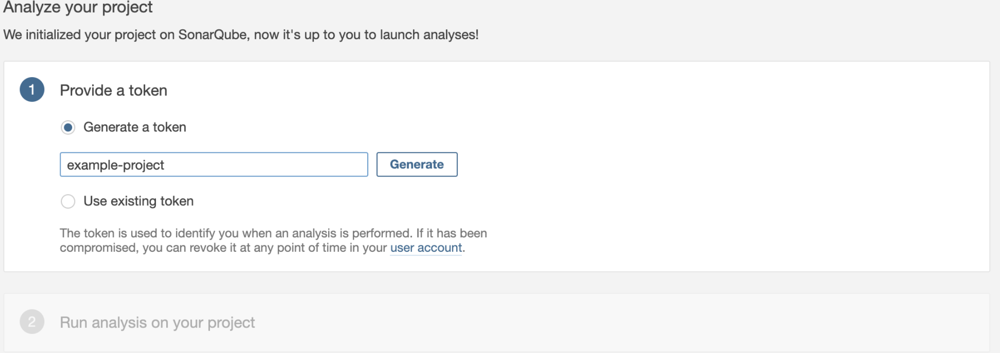
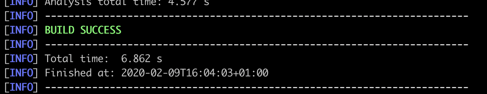

# Intégration continue boilerplate

***Rédiger par DURAND Antoine, THOMAS Hugo, JAMMES Yannick et SACHE Mickael.***

## I.	OBJECTIFS

Avoir un environnement de CI opérationnel et quelques minutes et sans polluer son OS.
Le but et de mettre en place via docker un outil de virtualisation 3 server en place sur votre machine : un serveur Jenkins , un serveur SonarQube et une serveur Gitlab. Avec cet environnement il vous seras facilement d’adapter la structure pour intégrer de la CI dans vos projets quelconque (NodeJs, Java).

Le schéma de l’environnement que nous allons mettre en place : 


## II.	INSTALLER DOCKER   

Pour installer Docker sur Windows, il faut obligatoirement Windows 10 professionnel, sinon il faudra télécharger Docker ToolBox.

Pour l’installation de Docker ou Docker ToolBox il est nécessaire d’avoir accès à un terminal de ligne de commande type “shell bash Linux”.  Pour linux et Mac utiliser le terminal natif. Si vous êtes sur windows et qu’il ne l’embarque pas déjà suivez le guide suivant ou un équivalent : https://www.zebulon.fr/astuces/divers/executer-linux-sous-windows-10.html.

Si vous ne pouvez pas installer le shell bash pour Windows installer et utiliser le bash github : https://git-scm.com/download/win.

**Windows 10 PRO :**
- Ce rendre sur le site de Docker : https://www.docker.com/get-started
- Cliquer sur le bouton “Download Desktop and Take a Tutorial”
- Créer un compte docker
- Télécharger l'exécutable pour windows 
- Double-cliquez sur "Docker Desktop Installateur.exe" pour lancer l'installateur
- Suivez l'assistant d'installation : acceptez la licence, autorisez l'installateur et procédez à l'installation
- Cliquez sur "Close" pour terminer l'installation
- Dans un nouveau terminal lancer ```docker -v``` si le terminal vous donne la version actuelle de docker alors l’installation est réussi


 - Vous pouvez maintenant lancer Docker Desktop en le recherchant dans la barre de recherche de Windows et en cliquant dessus
- Exécuter le tutoriel Docker Hello-World pour apprendre les commandes de bases de docker et vérifier l'installation ```docker run hello-world ```.

**Pour Windows 10 (Standard, Famille..) ou < 10 :**
- Ce rendre sur le GitHub Docker ToolBox : https://github.com/docker/toolbox/releases
- Télécharger le dernier exécutable stable disponible (“DockerToolbox-XX.XX.X.exe”)
- Suivre les instructions d’installations du launcher
- Une fois fini vous devriez avoir un nouveau programme “Docker QuickStart”
- Exécuter “Docker QuickStart”
- Un terminal s’ouvre, s’il demande un “User Account Control”, répondre par “Yes”
- Quand l’initialisation est finit, le terminal affichera un “$”
- Dans un nouveau terminal lancer ```docker -v``` si le terminal vous donne la version actuelle de docker alors l’installation est réussi


- Exécuter le tutoriel Docker Hello-World pour apprendre les commandes de bases de docker et vérifier l'installation.```docker run hello-world``` 

**Pour MacOS:**
- Ce rendre sur le Docker : https://docs.docker.com/docker-for-mac/install/ et cliquer sur “Download from Docker Hub”
- Créer un compte docker
- Exécuter le fichier “docker.dmg” 
- Suivre l’installateur comme pour toute application Mac déplacer l'exécutable dans le folder “Application”
- Une fois installer exécuter Docker
 
- Une fois docker lancer vous devriez voir apparaître dans votre top bar 

- Cliquer sur l’icone docker de la top bar

- Une fenêtre vous affichera le statut d'installation de votre docker et aussi un formulaire pour vous connecter avec votre compte docker.
- Dans un nouveau terminal lancer ```docker -v``` si le terminal vous donne la version actuelle de docker alors l’installation est réussi

- Exécuter le tutoriel Docker Hello-World pour apprendre les commandes de bases de docker et vérifier l'installation```docker run hello-world```.

**Pour Ubuntu Disco 19.04 / Cosmic 18.10 / Bionic 18.04 (LTS) / Xenial 16.04 (LTS) :**

METTRE EN PLACE LE DÉPÔT

- Ouvrez un terminal natif est updater le packages : ```sudo apt-get update```
- Installer des paquets pour permettre à apt d'utiliser un référentiel sur HTTPS :
```sudo apt-get install apt-transport-https ca-certificates curl gnupg-agent  software-properties-common```
- Ajoutez la clé GPG officielle de Docker :
```curl -fsSL https://download.docker.com/linux/ubuntu/gpg | sudo apt-key add -```
- Vérifiez que vous avez maintenant la clé avec l'empreinte digitale 9DC8 5822 9FC7 DD38 854A E2D8 8D81 803C 0EBF CD88, en recherchant les 8 derniers caractères de l'empreinte digitale.
```sudo apt-key fingerprint 0EBFCD88```
- Utilisez la commande suivante pour mettre en place le dépôt stable :
```sudo add-apt-repository "deb [arch=amd64] https://download.docker.com/linux/ubuntu $(lsb_release -cs) stable"```

INSTALLER DOCKER ENGINE - COMMUNITY

- Une fois le dépôt bien ajouter, lancer la commande : ```sudo apt-get update```
- Installer la dernière version de Docker Engine - Community : ```sudo apt-get install docker-ce docker-ce-cli containerd.io```
- Dans un nouveau terminal lancer ```docker -v``` si le terminal vous donne la version actuelle de docker alors l’installation est réussi

- Exécuter le tutoriel Docker Hello-World pour apprendre les commandes de bases de docker et vérifier l'installation```docker run hello-world```.


INSTALLER DOCKER COMPOSE 
- Cette commande permet de télécharger la version stable actuelle de Docker Compose : ```sudo curl -L "https://github.com/docker/compose/releases/download/1.25.3/docker-compose-$(uname -s)-$(uname -m)" -o /usr/local/bin/docker-compose```
- Appliquer les permissions d'exécution au binaire :
```sudo chmod +x /usr/local/bin/docker-compose```
- Test the installation : 
```docker-compose --version```
Cela devrait afficher : 


## III.	PRÉPARER L’ENVIRONNEMENT 

Nous allons démarrer 3 serveurs en même temps grâce à docker. Le serveur Jenkins, le serveur Gitlab et le serveur SonarQube. Or il faudra que ces trois serveurs puissent communiquer et échanger de données entre eux et avec votre ordinateur aussi. Ainsi pour des soucis de configuration future nous n’allons pas démarrer chaque service les uns après les autres mais exécuter un « docker-compose » qui va démarrer les 3 services en même temps avec la configuration nécessaire. 

Comment démarrer les services :

Tout d'abord, vous devez cloner ce dépôt :
``` git clone https://github.com/AntoineTohan/continuous-integration-boilerplate.git```

***Notez que vous devez installer git sur votre système : https://git-scm.com/***

Naviguez avec votre terminal jusqu'au dossier :
``` cd continu-intégration-boilerplate```

Vous pouvez maintenant commencer tous les services avec le Docker-compose :
``` docker-compose up -d```

Documentation des compose file : https://docs.docker.com/compose/compose-file/

Lister les containers en running status :
``` docker ps```

Liste des containers créée :


## GitLab configuration

**Qu'est ce que Gitlab ?**

GitLab est un logiciel libre de forge basé sur git proposant les fonctionnalités de wiki, un système de suivi des bugs, l’intégration continue et la livraison continue. 


- Accès à l'interface web de gitlab à l'adresse suivante : http://localhost:8081

- Entrez un mot de passe pour le compte root
- Vous pouvez maintenant vous connecter avec le nom d'utilisateur : root et votre mot de passe
- Une fois connecté, vous devrez autoriser le GitLab à demander un réseau local afin de permettre la communication entre le GitLab et Jenkins
- Aller aux paramètres (uniquement accessible avec le compte root)


- Allez ensuite dans la barre latérale gauche  "Settings -> Networks"

- Dans le menu "Outbound requests" cochez les deux cases : 


- Vous pouvez maintenant utiliser gitlab et créer les projets dont vous avez besoins.

## SonarQube configuration

**Qu'est ce que SonarQube ?**

SonarQube est un logiciel libre permettant de mesurer la qualité du code source en continu.


- Accès à sonarqube à l'adresse : http://localhost:9000

- Cliquez sur "Login". Le nom d'utilisateur et le mot de passe par défaut sont ```admin```.

- Par défaut, SonarQube ne peut analyser aucun code source car aucun plugin n'est installé. Il faut donc installer les plugins adaptés.

Cliquez sur "Administration" et "Marketplace" , et installer le plugin que vous voulez :


***Dans l'exemple ci dessus on ajoute Java***

- Example ajout de project Java (Maven ou Graddle) : 

- Créer un nouveau projet, cliquer sur "Create new project": 


- Nommer votre projet : 


- Gênerez un token, ajouter un nom et cliquer sur "Generate" : 



- Sélectionner "Java" , puis "maven ou "graddle" selon votre project : 


- Copier bien la commande  donner par sonar pour linker votre project au sonar.


Il vous suffira ensuite d'aller à la racine de votre project Java avec un terminal et lancer la commande copier précédemment. Vous devriez avoir un message : 



***Pour lancer une analyse sonar dans votre rpoject il vous suffire de lancer la commande ```mvn sonar:sonar```à la racine du projet concerné.***

## Jenkins configuration


**Qu'est ce que jenkins ?**

Jenkins est un outil d'intégration continue open source écrit en Java. Le projet a été conçu à partir de Hudson après un conflit avec Oracle.
Jenkins fournit des services d'intégration continue pour le développement de logiciels. Il s’agit d’un système serveur fonctionnant dans un conteneur de servlet tel que Apache Tomcat.


- Accèder à  Jenkins à l'adresse suivante : http://localhost:8080
- Une fenêtre apparaît vous demandant de déverrouiller Jenkins, pour trouver le mot de passe il faut  :

  - Par le terminal : 
    - ```docker ps``` copy container ID of jenkins. 
    - ```docker logs <ContainerID>``` and search the admin password generate in logs.

  - Directement dans votre explorateur de fichiers :
    - Allez à la racine du projet -> jenkins -> secrets -> initialAdminPassword
    
- Ensuite, cliquez sur Installer les plugins proposés et attendez la fin du processus
- Vous pouvez maintenant créer votre compte d'administration et cliquer sur "Save and Continue
- Laissez ensuite l'URL Jenkins suggérée et cliquez sur "Save and Finish". Pour permettre à Jenkins de communiquer avec GitLab et SonarQube, nous devons installer quelques plugins.
- Cliquez sur "Manage Jenkins" et ensuite sur "Manage Plugin"
- Ensuite, cliquez sur "Available" et recherchez GitLab et cochez la case GitLab plugin
- Maintenant, recherchez "SonarQube Scanner" et cochez la case du plugin SonarQube Scanner, puis cliquez sur "Download now and install after restart".
- 


- Ensuite cliquer sur "Restart Jenkins when installation is complete and no jobs are running"


Maintenant, tous les plugins nécessaires sont installés mais non configurés gitlab et sonar.

- Une fois que Jenkins est redémarré, allez à "Manage Jenkins", puis "Configure System"
- Allez dans la partie "SonarQube servers", cliquez sur "Add SonarQube" et ensuite, cochez "Enable injection of SonarQube server configuration...", donnez un nom  au sonar et définissez l'url du serveur sonar : http://sonar:9000


***Laisser le  plugin de Gitlab par défaut si vous réaliser de la CI non avancée***
- Appliquer et sauver les changements

 
##  Maintenir son environnement

Si vous avez suive la totalité des étapes précédantes vous devriez avoir un server SonarQube, Jenkins et Gitlab fonctionnel. Avec cette architecture vos serais en mesure de pouvoir appeler des analyse Sonar depuis Jenkins et déclencher des builds Jenkins depuis une actions Gitlab (commit / PR etc ....). 


Pour terminer quelques commandes afin de mettre en pause / supprimer tous l'environnement d'intégration continue mis en place.

Naviguez avec votre terminal jusqu'au dossier cloner depuis github :
```cd continu-intégration-boilerplate```

Vous pouvez maintenant mettre en pause les containers avec  :
``` docker-compose stop```

Vous pouvez maintenant supprimer tous les services avec le Docker-compose :
***Attention la suppression vous fera perdre toute votre configuration***
``` docker-compose down```


